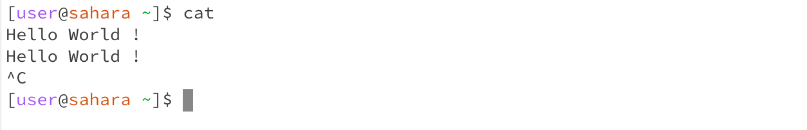

# Lab Report 1

# `cd`

The `cd` command allows us to change the current working directory to a specific folder or path. Usually, this command is followed by the name of the folder which we would like to move into. 

 > The current working directory before the cd command is `/home/lecture1/messages/`. After running the `cd` command with no arguments, the current working directory changes to `/home/`. So, `cd` followed by no arguments changes the current working directory to `/home/`. This is not an error.

> Here the `cd` command is followed by the path of the folder `lecture1/`. This is an acceptable argument. Therefore, the current working directory changes from `/home/` to `/home/lecture1/`. This is not an error.

> The `cd` command does not accept a file as an argument as it can not "change directory" to a file path. Here I have provided `Hello.java` as the argument and therefore it has caused an **error**. Hence the current working directory does not change. The current working directory remains `/home/`.

# `ls`

The `ls` command is used to list out all the files and folders in the current working directory or given path. This command may or may not be followed by a path. 

> Here the `ls` command is not followed by a path. So, the files and folders in the current working directory are printed. Here the current working directory is `/home/` which contains the `lecture1/` folder. Therefore, `lecture1` is printed out. This is not an error.

> Here the `ls` command is used with a path to the directory `lecture1/`. This is a valid argument. So, the files and folders which are within `lecture1/` are printed out. The current working directory remains as `/home/`. This is not an error.

> Since the `ls` command is used with a path to a file, it can not "list" the files or folders which are in the given path (as the file does not contain any files or folders). So, instead it just prints the path of the file as we have provided in the argument. The current working directory remains as `/home/`. This is not an error.

# `cat`

The `cat` command prints the contents of one or more files whose paths are provided. This command must be followed by one or more paths of specific files.

> The `cat` command requires an argument. Since I did not provide an argument above, the `cat` command did not execute anything. Instead, it was waiting for an argument. This is because it can not read the contents of a file if there is no file path provided. I used Ctrl + C to forcefully terminate the running process. The current working directory remains as `/home/`. This is not an error.

> Once again I have not provided any arguments to the `cat` command. However, in the following line I have provided a string `Hello World!`. The `cat` command reprints this text on the next line. Following this, it continues to wait for a valid file name as an argument. I have used Ctrl + C to once again forcefully terminate the running process. The current working directory remains `/home/`. This is not an error.

> The `cat` command does not work if we provide the path of a directory. This is because it can not read the contents of a folder. Instead, it causes an **error** and states that `lecture1/` is a directory. The current working directory remains as `/home/`.

> Here the `cat` command reads the contents of the file provided and prints it out. The current working directory remains as `/home/`. This is not an error.

> This command can be used to read the contents of one or more files. In this case, I have provided 2 file paths and the `cat` command reads the contents of both files and printed them out in the same order as I provided the paths. The current working directory remains as `/home/`.

