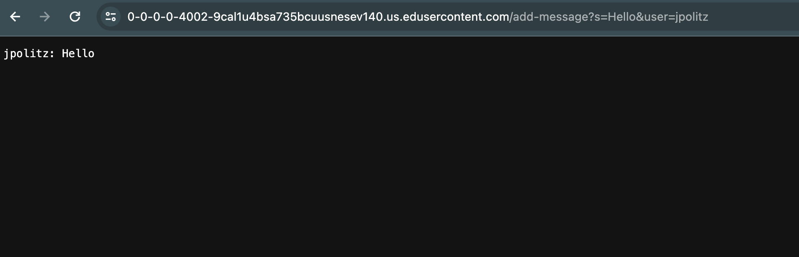
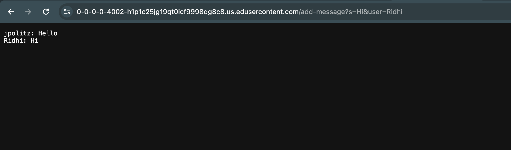
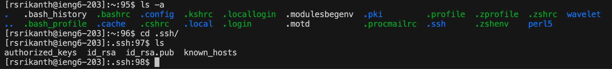
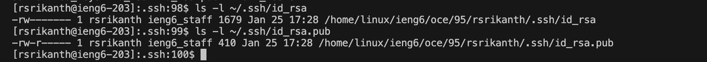
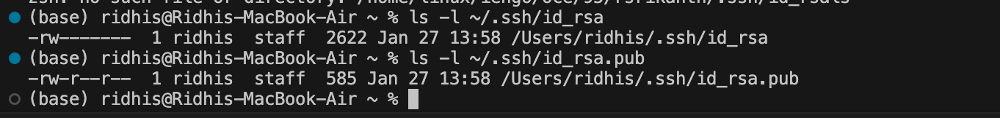
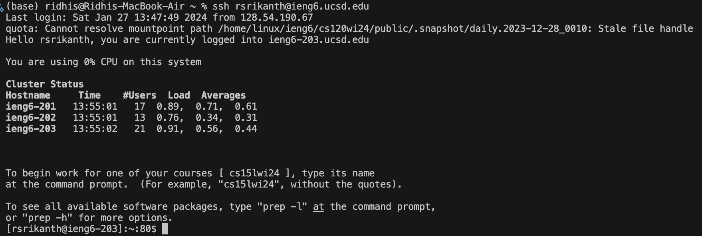

# Lab Report 2 

# Part One - Creating a Chat Server

Using java I have created a simple chat server which takes a query in the form `/add-message?s=<string>&user=<string>` and adds a chat message in the form `<user>: <message>`.

This is the `ChatServer.java` code : 

```
import java.io.IOException;
import java.net.URI;

class Handler implements URLHandler {
    // The one bit of state on the server: a number that will be manipulated by
    // various requests.
    int num = 0;
    String[] list = new String[10];
    int size = 0;

    public String handleRequest(URI url) {
        if (url.getPath().equals("/")) {
            return printingTheList();   
        } else if (url.getPath().contains("/add-message")) {
                String[] parameters = url.getQuery().split("&");
                String[] text = parameters[0].split("=");
                String[] user = parameters[1].split("=");
                if(size == list.length){
                        String[] list2 = new String[size*2];
                        for(int i=0; i<size; i++){
                            list2[i] = list[i];
                        }
                        list = list2;
                    }
                String chatMessage = user[1] + ": " + text[1] + "\n";
                list[size] = chatMessage;
                size += 1;
                return printingTheList();

        }
        return "404 Not Found!";
    }

    public String printingTheList(){
        String listString = "";
        for(int i=0; i<size; i++){
            listString += this.list[i];
        }
        return listString;
    }
}

class ChatServer {
    public static void main(String[] args) throws IOException {
        if(args.length == 0){
            System.out.println("Missing port number! Try any number between 1024 to 49151");
            return;
        }

        int port = Integer.parseInt(args[0]);

        Server.start(port, new Handler());
    }
}
```
Along with this code file I have used a Server.java file which defines the interface URLHandler, class ServerHttpHandler and class Server.

**Brief Explanation of `ChatServer.java` code :**  
The `ChatServer.java` file contains 2 classes - the Handler class and the ChatServer class. The Handler class checks whether the URL contains the `\add-message` query.  
If this query is found then the following string is split to find the `user` and the `message`. Finally, the string `<user> : <s> \n` is appended to the array `list` which keeps track of all the message strings and the contents of the list is displayed.



* All 3 methods in my code are called - handleRequest(), printingTheList() and main().
* Methods and Fields :  
      The argument passed to the handleRequest method was `url` which is `URi url=URI("https://0-0-0-0-4002-9cal1u4bsa735bcuusnesev140.us.edusercontent.com/add-message?s=Hello&user=jpolitz")`.  
      The argument to main() was args which is the port number - `args="4002"`.  
      Here the `List = ["jpolitz: Hello\n"]` and its `size=1`.  
* Changes :  
      The url passed to the handleRequest() method changes from null to `URI("https://0-0-0-0-4002-9cal1u4bsa735bcuusnesev140.us.edusercontent.com/add-message?s=Hello&user=jpolitz")`.  
      The parameters array becomes `["s=Hello", "user="jpolitz"]`.  
      The text array and user array also changes based on the .split() method.  
      The field `chatMessage` becomes `"jpolitz: Hello\n"`.  
      Finally, the List changes from `[]` to `["jpolitz: Hello\n"]` and size changes from 0 to 1.  



* All 3 methods in my code are called - handleRequest(), printingTheList() and main().
* Methods and Fields :  
      The argument passed to the handleRequest method was `url` which is `URI url=URI("https://0-0-0-0-4002-9cal1u4bsa735bcuusnesev140.us.edusercontent.com/add-message?s=Hi&user=Ridhi")`.  
      The argument to main() was args which is the port number - `args="4002"`.  
      Here the `List = ["jpolitz: Hello\n", "Ridhi: Hi\n"]` and its `size=2`.  
* Changes :  
      The url passed to the handleRequest() method changes from null to `URI("https://0-0-0-0-4002-9cal1u4bsa735bcuusnesev140.us.edusercontent.com/add-message?s=Hi&user=Ridhi")`.  
      The parameters array becomes `["s=Hi", "user="Ridhi"]`.  
      The text array and user array also changes based on the .split() method.  
      The field `chatMessage` becomes `"Ridhi: Hi\n"`.  
      Finally, the List changes from `["jpolitz: Hello\n"]` to `["jpolitz: Hello\n", "Ridhi: Hi\n"]` and size changes from 1 to 2.


  # Part Two - Private and Public Keys

  

  > Using the`ls` and `cd` command I have been able to navigate into the `.ssh` folder. I had to use `ls -a` to display all the hidden folders as `.ssh` is a hidden folder.
  > As seen above, the `.ssh` folder contains 4 files. The private key file is `id_rsa` and the public key file is `id_rsa.pub`. The absolute paths for these files are given below :
  >
  

  > These are the paths of the keys on the remote server :  
  > The absolute path of the private key is : `/home/linux/ieng6/oce/95/rsrikanth/.ssh/id_rsa`  
  > The absolute path of the public key is : `/home/linux/ieng6/oce/95/rsrikanth/.ssh/id_rsa.pub`  
  

  
  
  > These are the paths of the keys on the remote server :  
  > The absolute path of the private key is : `/Users/ridhis/.ssh/id_rsa`  
  > The absolute path of the public key is : `/Users/ridhis/.ssh/id_rsa.pub`
  >  
  To view the absolute path of the keys, I have used the command `ls -l <path of file>`.

  By adding this public key to the authorized_keys file in the .ssh folder, I no longer have to enter my password every time I want to log into to my remote account. The following 
  image shows this :
    
  
  
  
  # Part Three - What I have learned over the past 2 weeks

  * In the lab session of week 2 I learned how to set up and connect to a computer remotely. We used the command `ssh 
  <username>@ieng6.ucsd.edu` to establish a secure connection between our laptop and a computer in the cse basement. This allowed us to run 
  various programs on the remote computer such as a java server file which created a remote server. Prior to this, I had only heard of 
  remote servers and remote connections but had never explored the process of setting one up. Setting up a remote connection was realy 
  interesting for me !  
  * In the lab session of week 3 we furthered our exploration into remote computers and learned how to create a private and public key such     that we would not need to enter our password each time we would like to connect remotely. I also learned 3 new commands :
        -`scp` - It is used to securely transfer files over a network (between a local and remote device).
        - `mkdir` - Allows us to create a new directory.
        - `man` - Stand for manual and is used to display the details of any command passed as an argument.

  Over the last 2 lab session we also worked on building a chat server which was a really interesting project !

  
