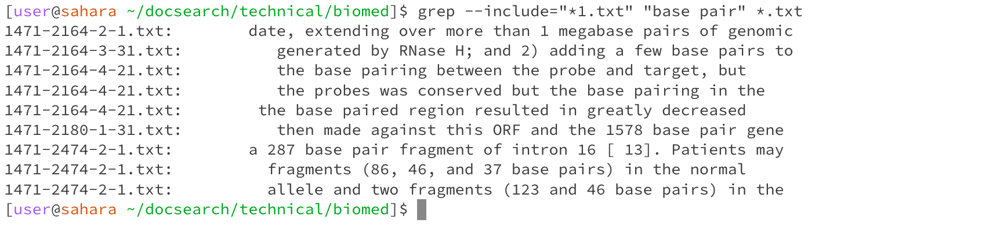
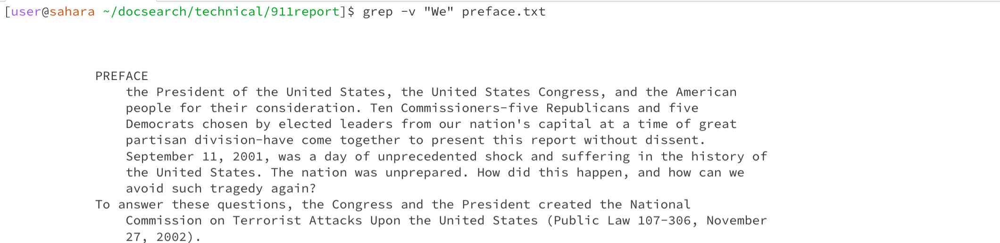
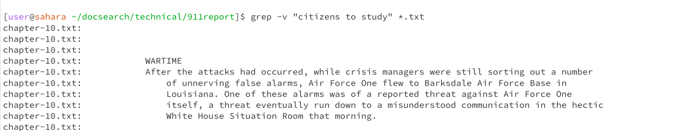
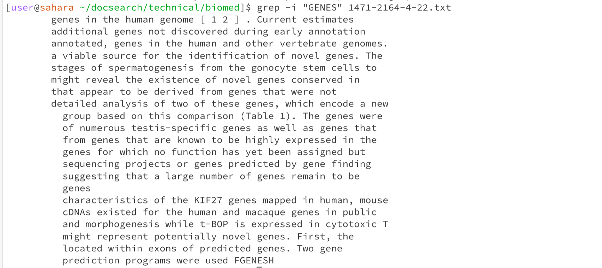

# Lab Report 3

# Part One - Bugs

The buggy program (The averageWithoutLowest() method) :  
```
public class buggyProgram {
    public int negativeCounter(int[] nums) {
        int counter = 0;
        for (int i : nums) {
            if (i <= 0) {
                counter++;
            }
        }
        return counter;
    }
}

```

Test with a failure-inducing input : 

```
    @Test
    public void testFails() {
        int negNums = bp.negativeCounter(listWithZeros);
        assertEquals(2, negNums);
    }
```

Test with a non-failure inducing input:

```
    @Test
    public void testPasses() {
        int negNums = bp.negativeCounter(listWithBoth);
        assertEquals(2, negNums);
    }
```

The Bug :
```
    public int negativeCounter(int[] nums) {
        int counter = 0;
        for (int i : nums) {
            if (i <= 0) {
                counter++;
            }
        }
        return counter;
    }
```


The Fixed code :

```
    public int negativeCounter(int[] nums) {
        int counter = 0;
        for (int i : nums) {
            if (i < 0) {
                counter++;
            }
        }
        return counter;
    }
```

# Part Two -  Researching Commands : Grep

1. The `grep` command can be used with the `-c` or `-count` option which counts the number of occurences of a pattern in a file. The command is like : `grep -c "phrase/word" files`.
      

> Here I have used the `-c` option to count the number of occurences of the word "is" in the text file `1471-213X-1-3.txt` which is in the `biomed` directory. The output is `163` which indicates that the word "is" appears 163 times in the file `1471-213X-1-3.txt`.
   

> Here I have used the `-c` option to count the number of occurences of the word "is" in all the text file in the `biomed` directory. I have used `*.txt` to refer to all the files in the text files in the biomed directory. The output displays the number of times "is" appears in each text file in the directory. The picture above only displays a portion of these text files as the list is very long.
   
2. The `grep` command can also be used with the `--include` option. This option searches through the files which match the pattern specified by the `--include` option. The command is like : `grep --include="file pattern" "phrase" file`.
      

> The command above only searches through files which match the pattern `*1.txt` for the phrase "base pair". The `--include` option is followed by the pattern which the resulting file names must follow. The output contains all the text files which end with "1" and have the phrase "base pair". Further, the output prints the line in which the phrase is present.
   

> The command above only searches through files which match the pattern `*2.txt` for the phrase "RRR-alpha-tocophery". There is only one file in the output. This is the only file in the biomed directory which ends with the number "2" and contains the phrase "RRR-alpha-tocophery".

3. The `grep` command can also be used with the `-v` option which works as an invert match. This command prints out all the words in the specified files which do not match the specified phrase/word. The command is : `grep -v "phrase/word" files`


> This prints out all the words in the `preface.txt` file which do not match the word "We". The output from this command is much longer as the file contains more text.


> Here the command searches through all the text files in the `911report` and prints out all the content which does not match the phrase "citizens to study". The output clearly shows which file each line corresponds to and the output is much larger than the image above.

4. The option `-i` with `grep` ignores the case when searching for phrases/words in files. Generally, `grep` is case sensitive. The command is : `grep -i "phrase/word" files`


> In the first line I have run `grep` without using the `-i` option. Since `grep` is case sensitive, there are no matches found for the phrase "BaSe PaIR" in any of the text files in the `biomed` directory. In the following command, I have used the `-i` option so grep ignores the case and searches for the phrase "BaSe PaIR" in all the text files in the `biomed` directory. Since `grep -i` is not case sensitive, multiple matches of the phrase "base pair" were found in many text files. The output contains the filename and line which contains the phrase. The image above does not contain the whole output.


> Here, `grep -i` seacrches for the word "GENES" (ignoring the case) in the text file `1471-2164-4-22.txt`. The command finds multiple matches such as "genes" and "GENES". The complete output from the command is shown in the image above.
   

