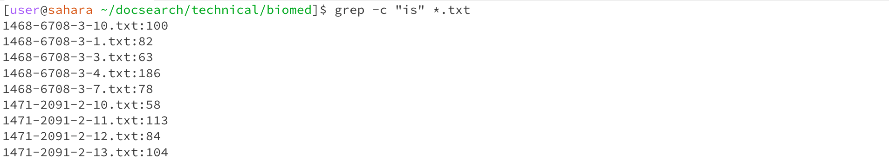

# Lab Report 3

# Part One - Bugs

The buggy program : 
```
public class buggyProgram {
    public int negativeCounter(int[] nums) {
        int counter = 0;
        for (int i : nums) {
            if (i <= 0) {
                counter++;
            }
        }
        return counter;
    }
}

```

A failure-inducing input : 

```
    @Test
    public void testFails() {
        int negNums = bp.negativeCounter(listWithZeros);
        assertEquals(2, negNums);
    }
```

A non-failure inducing input:

```
    @Test
    public void testPasses() {
        int negNums = bp.negativeCounter(listWithBoth);
        assertEquals(2, negNums);
    }
```

The Bug :
```
    public int negativeCounter(int[] nums) {
        int counter = 0;
        for (int i : nums) {
            if (i <= 0) {
                counter++;
            }
        }
        return counter;
    }
```


The Fixed code :

```
    public int negativeCounter(int[] nums) {
        int counter = 0;
        for (int i : nums) {
            if (i < 0) {
                counter++;
            }
        }
        return counter;
    }
```

# Part Two -  Researching Commands : Grep

1. The `grep` command can be used with the `-c` or `-count` option which counts the number of occurences of a pattern in a file.

> Here I have used the `-c` option to count the number of occurences of the word "is" in the text file `1471-213X-1-3.txt` which is in the `biomed` directory. The output is `163` which indicates that the word "is" appears 163 times in the file `1471-213X-1-3.txt`.


> Here I have used the `-c` option to count the number of occurences of the word "is" in all the text file in the `biomed` directory. I have used `*.txt` to refer to all the files in the text files in the biomed directory. The output displays the number of times "is" appears in each text file in the directory. The picture above only displays a portion of these text files as the list is very long.

2. The `grep` command can also be used with the 


