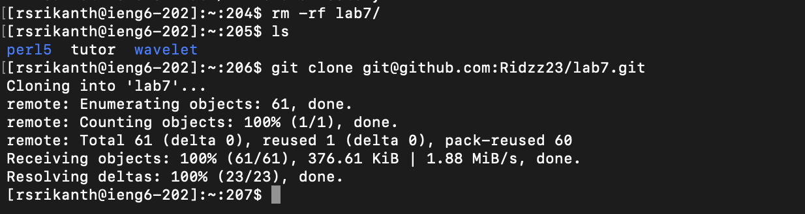

# Lab Report 4

# Step 1 - Log into ieng6

> To log into ieng6 I typed `ssh rsrikanth@ieng6.ucsd.edu`. I wasn't prompted to enter my password because I have set up the SSH key with my computer.

# Step 2 - Clone your fork of the repository from your Github account 

> Firstly, I typed out `rm -rf l<tab>` which tab completes the command to `rm -rf lab7/`. This deletes the lab7/ directory which is currently in my ieng6  account. Then I ran the command `git clone git@github.com:Ridzz23/lab7.git` to clone my fork of the `lab7` repository.

# Step 3 - Run the tests, demonstrating that they fail

> To compile all the java files I pressed `<up> <up> <up> <up> <up> <enter>`. The command `javac -cp .:lib/hamcrest-core-1.3.jar:lib/junit-4.13.2.jar *.java` was 5 up in the search history so I used up arrow to access it. Then to run the tests I wrote the command `java -cp .:lib/hamcrest-core-1.3.jar:lib/junit-4.13.2.jar org.junit.runner.JUnitCore ListExamplesTests`. 

# Step 4 - Edit the code file to fix the failing test

> Firstly, I typed `vim List<tab>.java` which tab completes to `vim ListExamples.java`. This allows me to enter the file `ListExamples.java` using the text editor `vim`.
> To navigate to the line which needs to be fixed I press the following keys :
> - `<down arrow>` 43 times
> - `<right arrow>` 11 times
> Now that I have reached the point of error I have to edit it. I press the following keys to do so :
> - `i` to enter insert mode
> - `<right arrow>` to move to the next spot
> - `<Backspace>` to delete the number 1
> - `2` to add the number 2
> - `<esc>` to exit insert mode and enter normal mode
> The change has been made. Now I need to save the changes and exit the text editor. I press `:wq<enter>` to save and exit.

# Step 5 - Run the tests, demonstrating that they now succeed

# Step 6 - Commit and push the resulting change to your Github account

