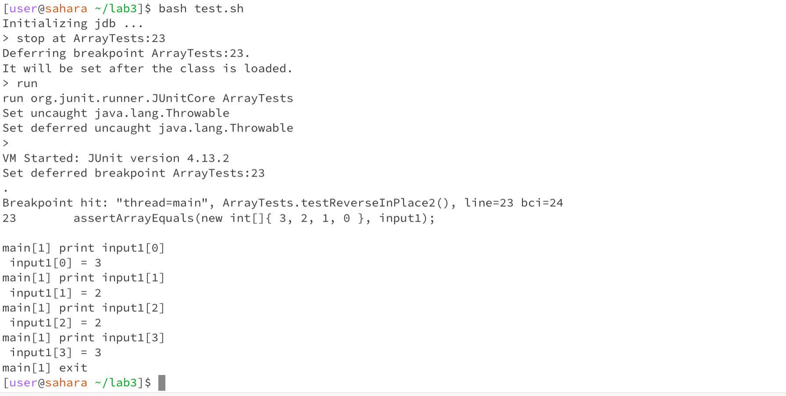

# Lab Report 5

# Part 1 - Debugging Scenario

**Luke Skywalker (The Jedi Student) :**  
Hello Master Yoda, 
I have been trying to reverse my array in place however some of the junit tests are failing. This is my method reverseInPlace() which currently contains a bug :   
```
static void reverseInPlace(int[] arr) {
    for(int i = 0; i < arr.length; i += 1) {
      arr[i] = arr[arr.length - i - 1];
    }
}
```
 When I try to run the following test it fails :
```
@Test 
public void testReverseInPlace2() {
    int[] input1 = { 0, 1, 2, 3 };
    ArrayExamples.reverseInPlace(input1);
    assertArrayEquals(new int[]{ 3, 2, 1, 0 }, input1);
}
```
This is the output I get :


The screenshot above indicates that the expected output of the reversal of `{ 0, 1, 2, 3 }` was `{ 3, 2, 1, 0 }` but instead the program produced something else.

I would really appreciate it if you could help me out here.

**Yoda (The Jedi TA) :**  
Hello there young Jedi,
Could you please share your file and directory structure as well as the full command line (or lines) you ran to trigger the bug.

Help you find the bug, I will.


**Luke Skywalker :**  
Yes of course. This is my file and directory structure :    
```
-lab 3
    - ArrayExamples.java
    - ArrayTests.java
    - test.sh
    - lib
        - hamcrest-core-1.3
        - junit-4.13.2
```
The file test.sh contains the following code :    

```
javac -g -cp .:lib/hamcrest-core-1.3.jar:lib/junit-4.13.2.jar *.java
java -cp .:lib/hamcrest-core-1.3.jar:lib/junit-4.13.2.jar org.junit.runner.JUnitCore ArrayTests
```

The file ArrayExamples.java contains the following code :  
```


public class ArrayExamples {

  // Changes the input array to be in reversed order
static void reverseInPlace(int[] arr) {
    for(int i = 0; i < arr.length; i += 1) {
      arr[i] = arr[arr.length - i - 1];
    }
} 

  // Returns a *new* array with all the elements of the input array in reversed
  // order
  static int[] reversed(int[] arr) {
    int[] newArray = new int[arr.length];
    for(int i = 0; i < arr.length; i += 1) {
      newArray[i] = arr[arr.length - i - 1];
    }
    return newArray;
  }

  // Averages the numbers in the array (takes the mean), but leaves out the
  // lowest number when calculating. Returns 0 if there are no elements or just
  // 1 element in the array
  static double averageWithoutLowest(double[] arr) {
    if(arr.length < 2) { return 0.0; }
    double lowest = arr[0];
    for(double num: arr) {
      if(num < lowest) { lowest = num; }
    }
    double sum = 0;
    for(double num: arr) {
      if(num != lowest) { sum += num; }
    }
    return sum / (arr.length - 1);
  }


}
```

The file ArrayTests.java contains the following code :  

```
import static org.junit.Assert.*;
import org.junit.*;

public class ArrayTests {
	@Test 
	public void testReverseInPlace() {
    int[] input1 = { 3 };
    ArrayExamples.reverseInPlace(input1);
    assertArrayEquals(new int[]{ 3 }, input1);
	}


  @Test
  public void testReversed() {
    int[] input1 = { };
    assertArrayEquals(new int[]{ }, ArrayExamples.reversed(input1));
  }

  @Test 
	public void testReverseInPlace2() {
    int[] input1 = { 0, 1, 2, 3 };
    ArrayExamples.reverseInPlace(input1);
    assertArrayEquals(new int[]{ 3, 2, 1, 0 }, input1);
	}


  @Test
  public void testReversed2() {
    int[] input1 = {1,2,3,4};
    assertArrayEquals(new int[]{4,3,2,1}, ArrayExamples.reversed(input1));
  }
}
```

These are the commands I ran on the command line which triggered the bug : 
```
$bash test.sh
```

**Yoda :**     
Hello there young Skywalker, 
To figure out the exact bug I would suggest running jdb. You could try the following commands to identify the bug :   
* Compile your code with the `-g` option 
* Run the debugger
* Create a break point at the line where your test fails
* run jdb : you can use the `run` command
* print the local variables of the array to identify what is going on : `print [variable name]`

Hopefully this helps you identify the bug. 
Identify the bug, you will.

**Luke Skywalker :**  

Hi,   
This is the output I got from the commands you suggested :    


From above, it looks like input1 is changing into `{ 3, 2, 2, 1 }` instead of `{ 3, 2, 1, 0 }`. This is probably because of the expression `arr[i] = arr[arr.length - i - 1];` in the code. When the program reaches the second half of the array, the expression `arr[arr.length - i - 1]` refers to the replaced values of `arr` in the first part of the array. Hence, the values 3 and 2 get repeated in the second half of the array. 

Thanks for the help !

# Part 2 - Reflection

Overall, this course has been incredibly enlightening. Before this, I had never delved so deeply into terminal usage. Yet, after nine weeks of predominantly terminal-based work, I've grown to value its tool. One aspect that stood out to me was the process of constructing an autograder. Exploring the different ways of building anautograder using bash and java has been quite interesting. 


